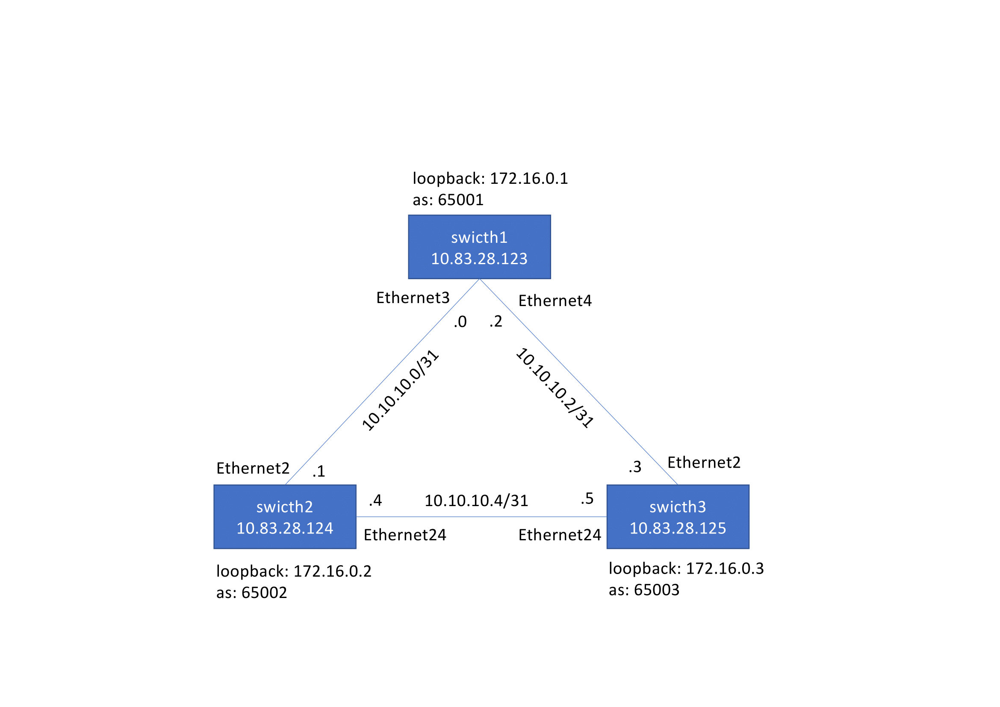

   

# Table of content 
[About this repository](#about-this-repository)  
[Playbooks description](#playbooks-description)  
[Repository structure](#repository-structure)  
[Network topology](#network-topology)  

# About this repository 

This repository has Ansible playbooks examples to automate Arista EOS. 

# Playbooks description

The playbooks are at the root of this repository. The playbooks name is `playbook_*.yml`.

These playbooks update devices configuration:  

- [playbook_enable_http_api.yml](playbook_enable_http_api.yml) uses SSH to enable eAPI.  

- [playbook_configure_using_files.yml](playbook_configure_using_files.yml) generates the EOS configuration files [conf_generated](outputs/conf_generated) from the template [config.j2](templates/config.j2) and loads the configuration generated on the EOS devices.  
It is used to configure this [lab](#network-topology) (interfaces and BGP configuration). 

- [playbook_manage_vlans.yml](playbook_manage_vlans.yml) manages VLANs and L2 interfaces in a declarative way. 

- [playbook_configure_using_lines.yml](playbook_configure_using_lines.yml) shows how you can configure a device with a set of commands. 
  
- [playbook_configure_login_banner.yml](playbook_configure_login_banner.yml) configures a multi lines login banner.  

These playbooks collect data from devices:  

- [playbook_print_version_and_model.yml](playbook_print_version_and_model.yml) executes a `show version` command and parses the command output and print the EOS version and device model.  

- [playbook_collect_commands.yml](playbook_collect_commands.yml) collects the EOS `show commands` defined in the file [audit.yml](group_vars/eos/audit.yml) and save the output in the directory [cli](outputs/cli).  
The output can be used for a humans review.  
To collect others EOS `show commands`, simply update the file [audit.yml](group_vars/eos/audit.yml).  

- [playbook_backup_configuration.yml](playbook_backup_configuration.yml) backups the running configuration in the directory [backup](outputs/backup). 

- [playbook_collect_facts_config.yml](playbook_collect_facts_config.yml) backups the running configuration in the directory [running_config](outputs/facts/running_config). 

- [playbook_collect_facts_hardware.yml](playbook_collect_facts_hardware.yml) returns the hardware facts (structured data about the device: SN, model, software version ...) and saves them in the directory [hardware](outputs/facts/hardware). 

- [playbook_collect_facts_resources.yml](playbook_collect_facts_resources.yml) returns some resources facts (structured data about the device: vlans, interfaces, ...) and saves them in the directory [resources](outputs/facts/resources).  

These playbooks validate the devices states:  

- [playbook_validate_states.yml](playbook_validate_states.yml) validates the devices states.  
It is used to validate this [lab](#network-topology).  
The validation covers HW model, SW release, environment (cooling, temperature, power), interfaces status, LLDP topology, BGP sessions, IP reachability tests.  
It compares the actual states with the desired states, and reports mismatches.  
  - The desired states are described in variables ([host_vars](host_vars) and [group_vars](group_vars) directories). So we reuse the same variables we already used to generate the configuration files.  
  - The actual states are the states on the devices. To get the actual states, it runs `show commands` with a json output, and parses the output.  
  - This playbook is interresting for CI because if a test fails, the pipeline will fail (either all the tests pass, or, the pipeline fails).  

- [playbook_generate_audit_report.yml](playbook_generate_audit_report.yml) audits the devices and generates this humans readable [report](outputs/audit/report.md).  
It is used to audit this [lab](#network-topology).  
The audit covers HW model, SW release, environment (cooling, temperature, power), interfaces status, LLDP topology, BGP sessions, IP reachability tests.  
It compares the actual states with the desired states and generates a report: 
  - The desired states are described in variables ([host_vars](host_vars) and [group_vars](group_vars) directories). So we reuse the same variables we already used to generate the configuration files.  
  - The actual states are the states on the devices.  
  - It runs `show commands` with a json representation and registers the outputs in variables. It doesnt process the data collected.  
  - Then it renders a template to generate the report. The data processing (data parsing and data comparaison) is done by the template (not by the playbook).  
  - This playbook doesnt fails if a test fail (because this playbook doesn’t run the tests itself, the tests are run by the template). So as example if a bgp session is not established the playbook will not fail but the report generated by the template will highlight this issue. 

# Repository structure 

- The playbooks are at the root of this repository. The playbooks name is `playbook_*.yml`.  
- The inventory file is [inventory.ini](inventory.ini)
- The variables are defined in the [host_vars](host_vars) and [group_vars](group_vars) directories 
- The directory [templates](templates) has the jinja templates used by the playbooks 
- The directory [roles](roles) has the roles used by the playbooks
- The directory [outputs](outputs) has the playbooks output 
- The requirements file is [requirements.txt](requirements.txt)
- The Ansible config file is [ansible.cfg](ansible.cfg)
  
# Network topology

3 EOS devices connected in a triangle topology and configured with EBGP   

