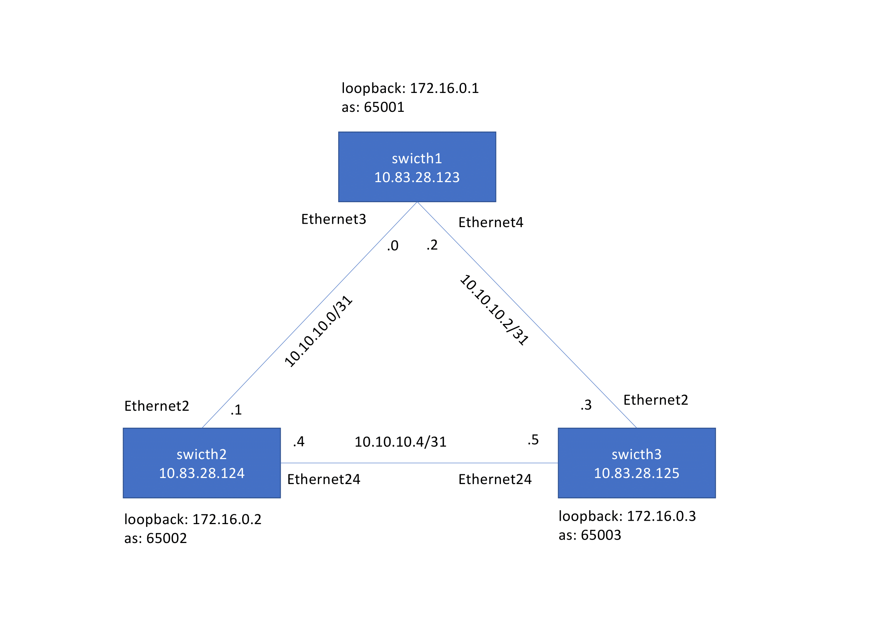

# About this repository 

This repository has Ansible playbooks examples to automate Arista EOS. 

# Repository structure 

- The requirements file is [requirements.txt](requirements.txt)
- The Ansible config file is [ansible.cfg](ansible.cfg)
- The directory [templates](templates) has the jinja templates used by the playbooks
- The directory [outputs](outputs) has the playbooks outout
- The inventory file is [inventory.ini](inventory.ini)
- The variables are defined in the [host_vars](host_vars) and [group_vars](group_vars) directories 
- The playbooks are at the root of this repository. The playbooks name is playbook_*.yaml.  

# Description of some playbooks 

- The playbook [playbook_collect_commands.yml](playbook_collect_commands.yml) collects the EOS `show commands` defined in the file [audit.yml](group_vars/eos/audit.yml) and save the output in the directory [cli](outputs/cli)
- The playbook [playbook_generate_audit_report.yml](playbook_generate_audit_report.yml) audits the devices and generate this [report](outputs/audit/report.md)
- The playbook [playbook_validate_states.yml](playbook_validate_states.yml) validate the devices states

# Network topology

3 EOS devices connected in a triangle topology and configured with EBGP   

